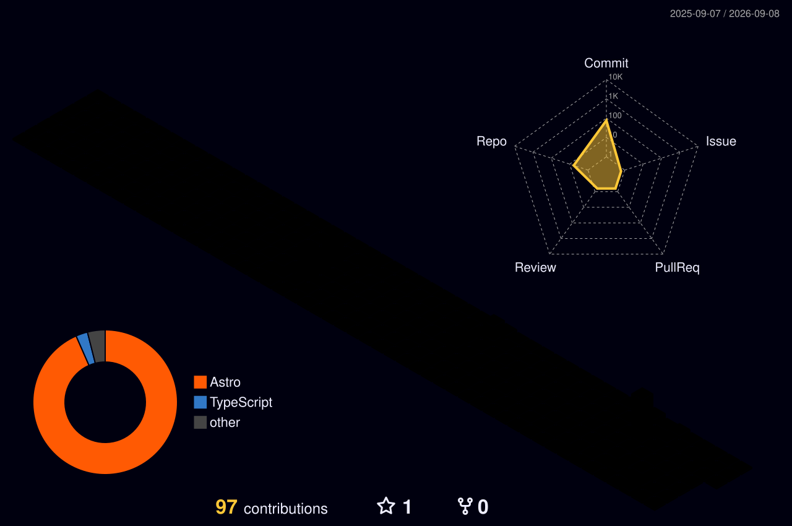

 

## 💫 About Me

- 🔭 Full-stack developer working across **C# / .NET**, **Angular**, and **React** ecosystems
- 🌱 Currently deepening my knowledge of modern web architecture and cloud tooling
- 🛠️ Comfortable across the stack — from SQL Server & Postgres to REST APIs to pixel-perfect UI
- 💬 Ask me about anything; if I don't know it, we'll figure it out
- ⚡ Fun fact: I enjoy tinkering with dev tooling as much as shipping features

 

## 🌐 Connect With Me

 

## 💻 Tech Stack

 
 
 

📋 Full badge list

 

                                

 

## 📊 GitHub Stats

### 🏙️ 3D Contribution City

 

